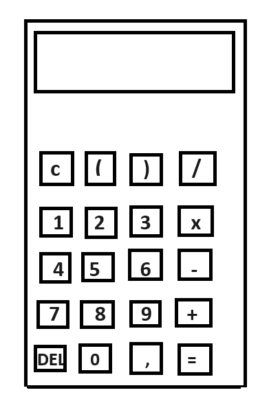

# Funkcionális specifikáció

## 1. Jelenlegi helyzet leírása

A mai világban fontos, hogy olyan alkalmazásokat használjunk a munkánk során, amelyek nem használják túlságosan a számítógépünket. Ezért a legtöbb cég az alkalmazásait minél egyszerűbben és letisztultabban tervezi meg.

## 2. Vágyállomrendszer leírása

A program célja, hogy a felhasználók egy letisztult, könnyen kezelhető és gyors alkalmazást kapjanak.

## 3. Jelenlegi üzleti folyamatok modellje
Jelenleg a megrendelőnek nincs megfelelő számológépe, amivel könnyedén tudna dolgozni a mindennapokban. 

## 4. Igényelt üzleti folyamatok modellje
A megrendelő bárhol és bármikor könnyedén tudja használni a letisztult számológépet.

## 5. Követelménylista

| Id | Modul | Név | Leírás |
| :---: | --- | --- | --- |
| K1 | Felület | Kijelző | Az elvégzendő művelet, illetve a művelet eredméynét jeleníti meg. |
| K2 | Felület | Gombok | A számokat (0-9) illetve alapműveleteket tudja bevinni a felhasználó. |

## 6. Használati esetek

Alapvető aritmetikai műveletek elvégzésére lehet használni.

## 7. Megfeleltetés, hogyan fedik le a használati eseteket a követelményeket

K1, K2: A felhasználó a gombok segítségével viszi be a számokat, illetve a műveleteket, majd az eredmény a kijelzőn megjelenik.

## 8. Képernyőtervek

## 9. Forgatókönyvek
Elindítva az alkalmazást bárhol könnyedén tudunk bonyolultabb matematikai feladatokat elvégezni.
## 10. Funkció - követelmény megfeleltetése

K1: A kijelzőn megjelennek a beütött számjegyek, műveletek, és az eredmény. K2: A különböző gombok megnyomásával bevihetőek a számok, amikkel műveletet kell elvégezni, és maguk a műveletek. 

## 11 Fogalomszótár
| Fogalom | Leírás |
| :---: | --- |
| C -gomb| kijelző ürítése|
| DEL -gomb | karakterek egyenkénti törlése |
